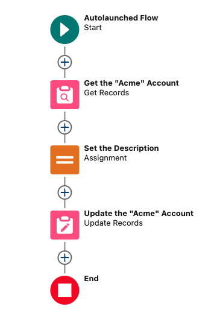
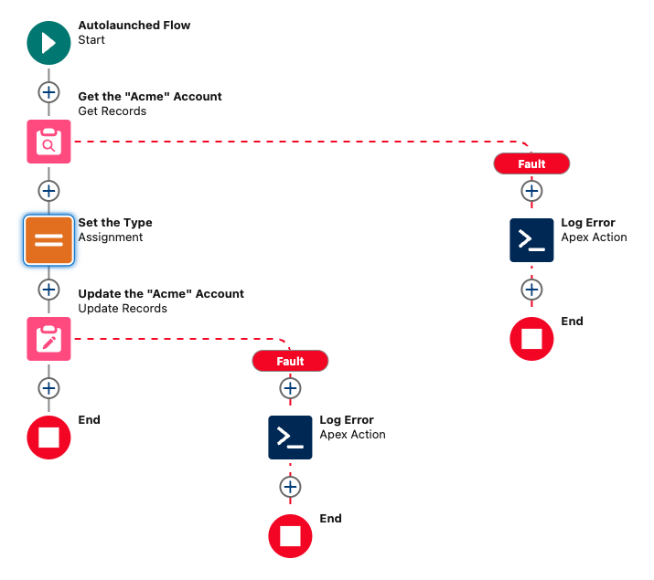
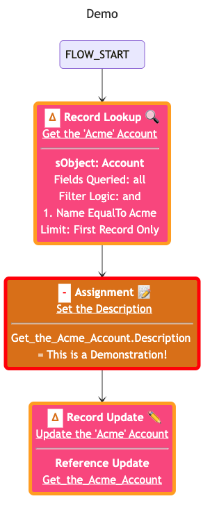
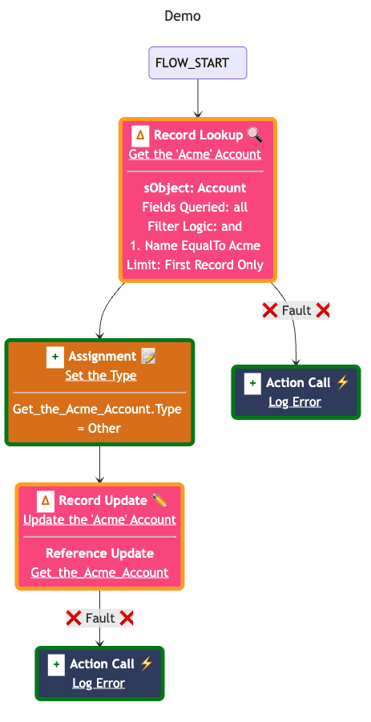

# Flow Lens


This project helps decode Salesforce Flows by translating their raw XML
definition files into human-understandable UML diagrams. These visualizations
clarify the flow's structure and logic, making documentation and code review
significantly easier. It supports generating diagrams using PlantUML, Graphviz, and
Mermaid, and can even highlight changes between different versions of a flow by
processing Git diffs.

Flow Lens is available on JSR, the JavaScript Registry. You can find the package at [jsr.io/@goog/flow-lens](https://jsr.io/@goog/flow-lens).

This is not an officially supported Google product. This project is not eligible
for the
[Google Open Source Software Vulnerability Rewards Program](https://bughunters.google.com/open-source-security).

## Features

- **Supports multiple diagram tools:** Generates diagrams using PlantUML,
  Graphviz, and Mermaid.
- **Handles Git diffs:** Can process changes between two Git commits,
  highlighting added, modified, and deleted elements in the resulting diagram.
- **GitHub Action integration:** Automatically posts flow diagrams as comments on pull requests.

## Usage

The tool is driven by command-line arguments. The following options are
available:

| Option              | Description                                                                                            | Type     | Default    | Required                            |
| ------------------- | ------------------------------------------------------------------------------------------------------ | -------- | ---------- | ----------------------------------- |
| `--mode`            | The output mode ('json' or 'github_action').                                                           | string   | `json`     | No                                  |
| `--diagramTool`     | The diagram tool to use ('plantuml', 'graphviz', or 'mermaid').                                        | string   | `graphviz` | No                                  |
| `--filePath`        | Path(s) to the Salesforce Flow XML file(s). Specify multiple files using space separated values.       | string[] |            | No (Git diff or file path required) |
| `--gitDiffFromHash` | The starting commit hash for the Git diff.                                                             | string   |            | No (Only with Git diff)             |
| `--gitDiffToHash`   | The ending commit hash for the Git diff.                                                               | string   |            | No (Only with Git diff)             |
| `--gitRepo`         | Path to the Git repository (required when using Git diff and the script isn't run from the repo root). | string   |            | No                                  |
| `--outputDirectory` | The directory to save the output file.                                                                 | string   |            | Yes (Only in json mode)             |
| `--outputFileName`  | The name of the output file (without extension).                                                       | string   |            | Yes (Only in json mode)             |

### Output Modes

Flow Lens supports two output modes:

1. **json mode (default):** Generates a JSON file containing the UML diagram(s) that can be used for further processing.
2. **github_action mode:** Automatically posts comments with flow diagrams on pull requests when used in a GitHub Actions workflow. When using this mode, you must specify `mermaid` as the diagram tool.

**Example using file path (json mode):**

```shell
deno run \
  --allow-read \
  --allow-write \
  jsr:@goog/flow-lens \
  --mode="json" \
  --diagramTool="graphviz" \
  --filePath="/some/path/force-app/main/default/flows/ArticleSubmissionStatus.flow-meta.xml" \
  --filePath="/some/path/force-app/main/default/flows/LeadConversionScreen.flow-meta.xml" \
  --filePath="/some/path/force-app/main/default/flows/OpportunityClosure.flow-meta.xml" \
  --outputDirectory="." \
  --outputFileName="test"
```

**Example using Git diff (json mode):**

```shell
deno run \
  --allow-read \
  --allow-write \
  jsr:@goog/flow-lens \
  --mode="json" \
  --diagramTool="graphviz" \
  --gitDiffFromHash="HEAD~1" \
  --gitDiffToHash="HEAD" \
  --gitRepo="/some/path/" \
  --outputDirectory="." \
  --outputFileName="test"
```

### Setting up a GitHub Action

You can set up a GitHub Action to automatically generate and post flow diagrams as comments on pull requests. Here's an example workflow configuration:

```yaml
name: Generate Flow Preview

on:
  pull_request:
    types: [opened, reopened, synchronize]

jobs:
  generate_preview:
    permissions: write-all
    runs-on: ubuntu-latest

    steps:
      - uses: actions/checkout@v3
        with:
          ref: ${{ github.ref }}
          fetch-depth: 2

      - name: Set up Deno
        uses: denoland/setup-deno@v2
        with:
          deno-version: latest

      - name: Generate flow diagrams
        run: |
          deno run \
            --allow-read \
            --allow-write \
            --allow-env \
            --allow-net \
            --allow-run \
            jsr:@goog/flow-lens \
            --mode="github_action" \
            --diagramTool="mermaid" \
            --gitDiffFromHash="HEAD^1" \
            --gitDiffToHash="HEAD"
        env:
          GITHUB_TOKEN: ${{ secrets.GITHUB_TOKEN }}
```

When using the GitHub Action mode, Flow Lens will automatically post a comment on the pull request with the old (if applicable) and new versions of the flow whenever a pull request is created or updated. This makes it easy to visualize flow changes directly in the pull request review process.

## Output

When using the json mode, the output is a JSON file containing the generated UML diagram(s). The structure
will contain the file paths and their associated old (if applicable) and new UML
strings.

```json
[
  {
    "path": "force-app/main/default/flows/ArticleSubmissionStatus.flow-meta.xml",
    "difference": {
      "old": "UML_STRING_HERE",
      "new": "UML_STRING_HERE"
    }
  },
  {
    "path": "force-app/main/default/flows/LeadConversionScreen.flow-meta.xml",
    "difference": {
      "old": "UML_STRING_HERE",
      "new": "UML_STRING_HERE"
    }
  }
]
```

## Frequently Asked Questions

### Why is this built using Deno?

Porting the project from Google's internal Blaze build system to Deno was easier
than setting it up in Node.js, as there is no transpilation step from TypeScript
to JavaScript. Deno's built-in TypeScript support made the migration process
much smoother.

### How is this different than Todd Halfpenny's flow visualizer?

While
[Todd's project](https://github.com/toddhalfpenny/salesforce-flow-visualiser) is
excellent, Flow Lens was built and used internally at Google before Todd's
project was available for commercial use. The key differentiator is that Flow
Lens represents flow differences structurally, making it ideal for assistance
with code reviews. This structural diff visualization is not available in other
flow visualization tools.

## Example

<table>
  <tr>
    <td> Old </td> <td> New </td>
  </tr>
  <tr>
    <td>
      
    </td>
    <td>
      
    </td>
  </tr>
</table>

```diff
<?xml version="1.0" encoding="UTF-8"?>
<Flow xmlns="http://soap.sforce.com/2006/04/metadata">
+  <actionCalls>
+    <name>Log_Error</name>
+    <label>Log Error</label>
+    <locationX>704</locationX>
+    <locationY>242</locationY>
+    <actionName>Demo</actionName>
+    <actionType>apex</actionType>
+    <flowTransactionModel>CurrentTransaction</flowTransactionModel>
+    <nameSegment>Demo</nameSegment>
+    <offset>0</offset>
+    <versionSegment>1</versionSegment>
+  </actionCalls>
+  <actionCalls>
+    <name>Log_Error2</name>
+    <label>Log Error</label>
+    <locationX>440</locationX>
+    <locationY>458</locationY>
+    <actionName>Demo</actionName>
+    <actionType>apex</actionType>
+    <flowTransactionModel>CurrentTransaction</flowTransactionModel>
+    <nameSegment>Demo</nameSegment>
+    <offset>0</offset>
+    <versionSegment>1</versionSegment>
+  </actionCalls>
  <apiVersion>62.0</apiVersion>
  <assignments>
-    <name>Set_the_Description</name>
-    <label>Set the Description</label>
+    <name>Set_the_Type</name>
+    <label>Set the Type</label>
    <locationX>176</locationX>
    <locationY>242</locationY>
    <assignmentItems>
-      <assignToReference>Get_the_Acme_Account.Description</assignToReference>
+      <assignToReference>Get_the_Acme_Account.Type</assignToReference>
      <operator>Assign</operator>
      <value>
-        <stringValue>This is a Demonstration!</stringValue>
+        <stringValue>Other</stringValue>
      </value>
    </assignmentItems>
    <connector>
      <targetReference>Update_the_Acme_Account</targetReference>
    </connector>
  </assignments>
  <constants>
    <name>Acme</name>
    <dataType>String</dataType>
    <value>
      <stringValue>Acme</stringValue>
    </value>
  </constants>
  <environments>Default</environments>
  <interviewLabel>Demo {!$Flow.CurrentDateTime}</interviewLabel>
  <label>Demo</label>
  <processMetadataValues>
    <name>BuilderType</name>
    <value>
      <stringValue>LightningFlowBuilder</stringValue>
    </value>
  </processMetadataValues>
  <processMetadataValues>
    <name>CanvasMode</name>
    <value>
      <stringValue>AUTO_LAYOUT_CANVAS</stringValue>
    </value>
  </processMetadataValues>
  <processMetadataValues>
    <name>OriginBuilderType</name>
    <value>
      <stringValue>LightningFlowBuilder</stringValue>
    </value>
  </processMetadataValues>
  <processType>AutoLaunchedFlow</processType>
  <recordLookups>
    <name>Get_the_Acme_Account</name>
    <label>Get the &quot;Acme&quot; Account</label>
    <locationX>176</locationX>
    <locationY>134</locationY>
    <assignNullValuesIfNoRecordsFound>false</assignNullValuesIfNoRecordsFound>
    <connector>
-      <targetReference>Set_the_Description</targetReference>
+      <targetReference>Set_the_Type</targetReference>
    </connector>
+    <faultConnector>
+      <targetReference>Log_Error</targetReference>
+    </faultConnector>
    <filterLogic>and</filterLogic>
    <filters>
      <field>Name</field>
      <operator>EqualTo</operator>
      <value>
        <elementReference>Acme</elementReference>
      </value>
    </filters>
    <getFirstRecordOnly>true</getFirstRecordOnly>
    <object>Account</object>
    <storeOutputAutomatically>true</storeOutputAutomatically>
  </recordLookups>
  <recordUpdates>
    <name>Update_the_Acme_Account</name>
    <label>Update the &quot;Acme&quot; Account</label>
    <locationX>176</locationX>
    <locationY>350</locationY>
+    <faultConnector>
+      <targetReference>Log_Error2</targetReference>
+    </faultConnector>
    <inputReference>Get_the_Acme_Account</inputReference>
  </recordUpdates>
  <start>
    <locationX>50</locationX>
    <locationY>0</locationY>
    <connector>
      <targetReference>Get_the_Acme_Account</targetReference>
    </connector>
  </start>
  <status>Active</status>
</Flow>
```

```sh
deno run \
  --allow-read \
  --allow-write \
  jsr:@goog/flow-lens \
  --diagramTool="graphviz" \
  --gitRepo="/path/to/salesforce_project/" \
  --gitDiffFromHash="HEAD~1" \
  --gitDiffToHash="HEAD" \
  --outputDirectory="." \
  --outputFileName="test"
```

`test.json`

```json
[
  {
    "path": "force-app/main/default/flows/Demo.flow-meta.xml",
    "difference": {
      "old": "digraph {\nlabel=<<B>Demo</B>>\ntitle = \"Demo\";\nlabelloc = \"t\";\nnode [shape=box, style=filled]\nSet_the_Description [\n  label=<\n<TABLE CELLSPACING=\"0\" CELLPADDING=\"0\">\n  <TR><TD BGCOLOR=\"WHITE\" WIDTH=\"20\"><FONT COLOR=\"red\"><B>-</B></FONT></TD>\n    <TD>\n      <B>Assignment ⬅️</B>\n    </TD>\n  </TR>\n  <TR>\n    <TD COLSPAN=\"2\"><U>Set the Description</U></TD>\n  </TR>\n</TABLE>\n>\n  color=\"#DD7A00\"\n  fontcolor=\"white\"\n];\nGet_the_Acme_Account [\n  label=<\n<TABLE CELLSPACING=\"0\" CELLPADDING=\"0\">\n  <TR><TD BGCOLOR=\"WHITE\" WIDTH=\"20\"><FONT COLOR=\"#DD7A00\"><B>Δ</B></FONT></TD>\n    <TD>\n      <B>Record Lookup 🔍</B>\n    </TD>\n  </TR>\n  <TR>\n    <TD COLSPAN=\"2\"><U>Get the 'Acme' Account</U></TD>\n  </TR>\n</TABLE>\n>\n  color=\"#F9548A\"\n  fontcolor=\"white\"\n];\nUpdate_the_Acme_Account [\n  label=<\n<TABLE CELLSPACING=\"0\" CELLPADDING=\"0\">\n  <TR><TD BGCOLOR=\"WHITE\" WIDTH=\"20\"><FONT COLOR=\"#DD7A00\"><B>Δ</B></FONT></TD>\n    <TD>\n      <B>Record Update ✏️</B>\n    </TD>\n  </TR>\n  <TR>\n    <TD COLSPAN=\"2\"><U>Update the 'Acme' Account</U></TD>\n  </TR>\n</TABLE>\n>\n  color=\"#F9548A\"\n  fontcolor=\"white\"\n];\nFLOW_START -> Get_the_Acme_Account [label=\"\" color=\"black\" style=\"\"]\nGet_the_Acme_Account -> Set_the_Description [label=\"\" color=\"black\" style=\"\"]\nSet_the_Description -> Update_the_Acme_Account [label=\"\" color=\"black\" style=\"\"]\n}",
      "new": "digraph {\nlabel=<<B>Demo</B>>\ntitle = \"Demo\";\nlabelloc = \"t\";\nnode [shape=box, style=filled]\nSet_the_Type [\n  label=<\n<TABLE CELLSPACING=\"0\" CELLPADDING=\"0\">\n  <TR><TD BGCOLOR=\"WHITE\" WIDTH=\"20\"><FONT COLOR=\"green\"><B>+</B></FONT></TD>\n    <TD>\n      <B>Assignment ⬅️</B>\n    </TD>\n  </TR>\n  <TR>\n    <TD COLSPAN=\"2\"><U>Set the Type</U></TD>\n  </TR>\n</TABLE>\n>\n  color=\"#DD7A00\"\n  fontcolor=\"white\"\n];\nGet_the_Acme_Account [\n  label=<\n<TABLE CELLSPACING=\"0\" CELLPADDING=\"0\">\n  <TR><TD BGCOLOR=\"WHITE\" WIDTH=\"20\"><FONT COLOR=\"#DD7A00\"><B>Δ</B></FONT></TD>\n    <TD>\n      <B>Record Lookup 🔍</B>\n    </TD>\n  </TR>\n  <TR>\n    <TD COLSPAN=\"2\"><U>Get the 'Acme' Account</U></TD>\n  </TR>\n</TABLE>\n>\n  color=\"#F9548A\"\n  fontcolor=\"white\"\n];\nUpdate_the_Acme_Account [\n  label=<\n<TABLE CELLSPACING=\"0\" CELLPADDING=\"0\">\n  <TR><TD BGCOLOR=\"WHITE\" WIDTH=\"20\"><FONT COLOR=\"#DD7A00\"><B>Δ</B></FONT></TD>\n    <TD>\n      <B>Record Update ✏️</B>\n    </TD>\n  </TR>\n  <TR>\n    <TD COLSPAN=\"2\"><U>Update the 'Acme' Account</U></TD>\n  </TR>\n</TABLE>\n>\n  color=\"#F9548A\"\n  fontcolor=\"white\"\n];\nLog_Error [\n  label=<\n<TABLE CELLSPACING=\"0\" CELLPADDING=\"0\">\n  <TR><TD BGCOLOR=\"WHITE\" WIDTH=\"20\"><FONT COLOR=\"green\"><B>+</B></FONT></TD>\n    <TD>\n      <B>Action Call ⚡</B>\n    </TD>\n  </TR>\n  <TR>\n    <TD COLSPAN=\"2\"><U>Log Error</U></TD>\n  </TR>\n</TABLE>\n>\n  color=\"#344568\"\n  fontcolor=\"white\"\n];\nLog_Error2 [\n  label=<\n<TABLE CELLSPACING=\"0\" CELLPADDING=\"0\">\n  <TR><TD BGCOLOR=\"WHITE\" WIDTH=\"20\"><FONT COLOR=\"green\"><B>+</B></FONT></TD>\n    <TD>\n      <B>Action Call ⚡</B>\n    </TD>\n  </TR>\n  <TR>\n    <TD COLSPAN=\"2\"><U>Log Error</U></TD>\n  </TR>\n</TABLE>\n>\n  color=\"#344568\"\n  fontcolor=\"white\"\n];\nFLOW_START -> Get_the_Acme_Account [label=\"\" color=\"black\" style=\"\"]\nGet_the_Acme_Account -> Set_the_Type [label=\"\" color=\"black\" style=\"\"]\nGet_the_Acme_Account -> Log_Error [label=\"Fault\" color=\"red\" style=\"dashed\"]\nSet_the_Type -> Update_the_Acme_Account [label=\"\" color=\"black\" style=\"\"]\nUpdate_the_Acme_Account -> Log_Error2 [label=\"Fault\" color=\"red\" style=\"dashed\"]\n}"
    }
  }
]
```

<table>
  <tr>
    <td> Old </td> <td> New </td>
  </tr>
  <tr>
    <td>
      
    </td>
    <td>
      
    </td>
  </tr>
</table>
