# Flow Lens


This project helps decode Salesforce Flows by translating their raw XML
definition files into human-understandable UML diagrams. These visualizations
clarify the flow's structure and logic, making documentation and code review
significantly easier. It supports generating diagrams using PlantUML, Graphviz,
and Mermaid, and can even highlight changes between different versions of a flow
by processing Git diffs.

Flow Lens is available on JSR, the JavaScript Registry. You can find the package
at [jsr.io/@goog/flow-lens](https://jsr.io/@goog/flow-lens).

This is not an officially supported Google product. This project is not eligible
for the
[Google Open Source Software Vulnerability Rewards Program](https://bughunters.google.com/open-source-security).

## Features

- **Supports multiple diagram tools:** Generates diagrams using PlantUML,
  Graphviz, and Mermaid.
- **Handles Git diffs:** Can process changes between two Git commits,
  highlighting added, modified, and deleted elements in the resulting diagram.
- **GitHub Action integration:** Automatically posts flow diagrams as comments
  on pull requests.

## Usage

The tool is driven by command-line arguments. The following options are
available:

| Option              | Description                                                                                            | Type     | Default    | Required                            |
| ------------------- | ------------------------------------------------------------------------------------------------------ | -------- | ---------- | ----------------------------------- |
| `--mode`            | The output mode ('json', 'markdown', or 'github_action').                                              | string   | `json`     | No                                  |
| `--diagramTool`     | The diagram tool to use ('plantuml', 'graphviz', or 'mermaid').                                        | string   | `graphviz` | No                                  |
| `--filePath`        | Path(s) to the Salesforce Flow XML file(s). Specify multiple files using space separated values.       | string[] |            | No (Git diff or file path required) |
| `--gitDiffFromHash` | The starting commit hash for the Git diff.                                                             | string   |            | No (Only with Git diff)             |
| `--gitDiffToHash`   | The ending commit hash for the Git diff.                                                               | string   |            | No (Only with Git diff)             |
| `--gitRepo`         | Path to the Git repository (required when using Git diff and the script isn't run from the repo root). | string   |            | No                                  |
| `--outputDirectory` | The directory to save the output file.                                                                 | string   |            | Yes (Only in json mode)             |
| `--outputFileName`  | The name of the output file (without extension).                                                       | string   |            | Yes (Only in json mode)             |

**Example using file path (json mode):**

```shell
deno run \
  --allow-read \
  --allow-write \
  jsr:@goog/flow-lens \
  --mode="json" \
  --diagramTool="graphviz" \
  --filePath="/some/path/force-app/main/default/flows/ArticleSubmissionStatus.flow-meta.xml" \
  --filePath="/some/path/force-app/main/default/flows/LeadConversionScreen.flow-meta.xml" \
  --filePath="/some/path/force-app/main/default/flows/OpportunityClosure.flow-meta.xml" \
  --outputDirectory="." \
  --outputFileName="test"
```

**Example using Git diff (json mode):**

```shell
deno run \
  --allow-read \
  --allow-write \
  jsr:@goog/flow-lens \
  --mode="json" \
  --diagramTool="graphviz" \
  --gitDiffFromHash="HEAD~1" \
  --gitDiffToHash="HEAD" \
  --gitRepo="/some/path/" \
  --outputDirectory="." \
  --outputFileName="test"
```

## Output

Flow Lens supports three output modes:

1. **json mode (default):** Generates a JSON file containing the UML diagram(s)
   that can be used for further processing.
2. **markdown mode:** Generates individual `.md` files for each flow in the
   specified output directory. Each markdown file contains Mermaid diagrams
   wrapped in code blocks.
3. **github_action mode:** Automatically posts comments with flow diagrams on
   pull requests when used in a GitHub Actions workflow. When using this mode,
   you must specify `mermaid` as the diagram tool.

### JSON Mode (default)

When using the `json` mode, the output is a JSON file containing the generated
UML diagram(s). The structure will contain the file paths and their associated
old (if applicable) and new UML strings.

```json
[
  {
    "path": "force-app/main/default/flows/ArticleSubmissionStatus.flow-meta.xml",
    "difference": {
      "old": "UML_STRING_HERE",
      "new": "UML_STRING_HERE"
    }
  },
  {
    "path": "force-app/main/default/flows/LeadConversionScreen.flow-meta.xml",
    "difference": {
      "old": "UML_STRING_HERE",
      "new": "UML_STRING_HERE"
    }
  }
]
```

### Markdown Mode

When using the `markdown` mode, Flow Lens generates individual `.md` files for
each flow in the specified output directory. Each markdown file is named after
the flow's API name and contains the UML diagram wrapped in Mermaid code blocks.

**File Structure:**

```
outputDirectory/
├── FlowName1.md
├── FlowName2.md
└── FlowName3.md
```

**Markdown Content Format:**

- If there's only a new version (no diff), the file contains a single Mermaid
  diagram
- If there are both old and new versions (diff mode), the file contains:
  - `## Old Version` section with the previous diagram
  - `## New Version` section with the current diagram
- Each diagram is wrapped in triple backticks with the `mermaid` language
  identifier

**Note:** Markdown mode only works with the `mermaid` diagram tool and requires
an `outputDirectory` to be specified.

### GitHub Action Mode

When using the `github_action` mode, Flow Lens automatically posts flow diagrams
as comments on pull requests. This mode is designed for use in GitHub Actions
workflows and requires the `mermaid` diagram tool.

**Requirements:**

- Must be run in a GitHub Actions workflow
- Requires `mermaid` as the diagram tool
- Needs appropriate GitHub permissions to post comments
- Requires `GITHUB_TOKEN` environment variable

**Example GitHub Actions Workflow:**

```yaml
name: Generate Flow Preview

on:
  pull_request:
    types: [opened, reopened, synchronize]

jobs:
  generate_preview:
    permissions: write-all
    runs-on: ubuntu-latest

    steps:
      - uses: actions/checkout@v3
        with:
          ref: ${{ github.ref }}
          fetch-depth: 2

      - name: Set up Deno
        uses: denoland/setup-deno@v2
        with:
          deno-version: latest

      - name: Generate flow diagrams
        run: |
          deno run \
            --allow-read \
            --allow-write \
            --allow-env \
            --allow-net \
            --allow-run \
            jsr:@goog/flow-lens \
            --mode="github_action" \
            --diagramTool="mermaid" \
            --gitDiffFromHash="HEAD^1" \
            --gitDiffToHash="HEAD"
        env:
          GITHUB_TOKEN: ${{ secrets.GITHUB_TOKEN }}
```

**What Happens:**

- Flow Lens detects the pull request context automatically
- Generates Mermaid diagrams for changed flows
- Posts a comment with both old and new versions (if applicable)
- Updates existing comments when the PR is modified
- Requires no manual file management or output directory setup

## Example

<table>
  <tr>
    <td> Old </td> <td> New </td>
  </tr>
  <tr>
    <td>
      
    </td>
    <td>
      
    </td>
  </tr>
</table>

```diff
<?xml version="1.0" encoding="UTF-8"?>
<Flow xmlns="http://soap.sforce.com/2006/04/metadata">
+  <actionCalls>
+    <name>Log_Error</name>
+    <label>Log Error</label>
+    <locationX>704</locationX>
+    <locationY>242</locationY>
+    <actionName>Demo</actionName>
+    <actionType>apex</actionType>
+    <flowTransactionModel>CurrentTransaction</flowTransactionModel>
+    <nameSegment>Demo</nameSegment>
+    <offset>0</offset>
+    <versionSegment>1</versionSegment>
+  </actionCalls>
+  <actionCalls>
+    <name>Log_Error2</name>
+    <label>Log Error</label>
+    <locationX>440</locationX>
+    <locationY>458</locationY>
+    <actionName>Demo</actionName>
+    <actionType>apex</actionType>
+    <flowTransactionModel>CurrentTransaction</flowTransactionModel>
+    <nameSegment>Demo</nameSegment>
+    <offset>0</offset>
+    <versionSegment>1</versionSegment>
+  </actionCalls>
  <apiVersion>62.0</apiVersion>
  <assignments>
-    <name>Set_the_Description</name>
-    <label>Set the Description</label>
+    <name>Set_the_Type</name>
+    <label>Set the Type</label>
    <locationX>176</locationX>
    <locationY>242</locationY>
    <assignmentItems>
-      <assignToReference>Get_the_Acme_Account.Description</assignToReference>
+      <assignToReference>Get_the_Acme_Account.Type</assignToReference>
      <operator>Assign</operator>
      <value>
-        <stringValue>This is a Demonstration!</stringValue>
+        <stringValue>Other</stringValue>
      </value>
    </assignmentItems>
    <connector>
      <targetReference>Update_the_Acme_Account</targetReference>
    </connector>
  </assignments>
  <constants>
    <name>Acme</name>
    <dataType>String</dataType>
    <value>
      <stringValue>Acme</stringValue>
    </value>
  </constants>
  <environments>Default</environments>
  <interviewLabel>Demo {!$Flow.CurrentDateTime}</interviewLabel>
  <label>Demo</label>
  <processMetadataValues>
    <name>BuilderType</name>
    <value>
      <stringValue>LightningFlowBuilder</stringValue>
    </value>
  </processMetadataValues>
  <processMetadataValues>
    <name>CanvasMode</name>
    <value>
      <stringValue>AUTO_LAYOUT_CANVAS</stringValue>
    </value>
  </processMetadataValues>
  <processMetadataValues>
    <name>OriginBuilderType</name>
    <value>
      <stringValue>LightningFlowBuilder</stringValue>
    </value>
  </processMetadataValues>
  <processType>AutoLaunchedFlow</processType>
  <recordLookups>
    <name>Get_the_Acme_Account</name>
    <label>Get the &quot;Acme&quot; Account</label>
    <locationX>176</locationX>
    <locationY>134</locationY>
    <assignNullValuesIfNoRecordsFound>false</assignNullValuesIfNoRecordsFound>
    <connector>
-      <targetReference>Set_the_Description</targetReference>
+      <targetReference>Set_the_Type</targetReference>
    </connector>
+    <faultConnector>
+      <targetReference>Log_Error</targetReference>
+    </faultConnector>
    <filterLogic>and</filterLogic>
    <filters>
      <field>Name</field>
      <operator>EqualTo</operator>
      <value>
        <elementReference>Acme</elementReference>
      </value>
    </filters>
    <getFirstRecordOnly>true</getFirstRecordOnly>
    <object>Account</object>
    <storeOutputAutomatically>true</storeOutputAutomatically>
  </recordLookups>
  <recordUpdates>
    <name>Update_the_Acme_Account</name>
    <label>Update the &quot;Acme&quot; Account</label>
    <locationX>176</locationX>
    <locationY>350</locationY>
+    <faultConnector>
+      <targetReference>Log_Error2</targetReference>
+    </faultConnector>
    <inputReference>Get_the_Acme_Account</inputReference>
  </recordUpdates>
  <start>
    <locationX>50</locationX>
    <locationY>0</locationY>
    <connector>
      <targetReference>Get_the_Acme_Account</targetReference>
    </connector>
  </start>
  <status>Active</status>
</Flow>
```

```sh
deno run \
  --allow-read \
  --allow-write \
  --allow-run \
  --allow-env \
  jsr:@goog/flow-lens \
  --mode="markdown" \
  --diagramTool="mermaid" \
  --gitRepo="/path/to/salesforce_project/" \
  --gitDiffFromHash="HEAD~1" \
  --gitDiffToHash="HEAD" \
  --outputDirectory="." \
  --outputFileName="test"
```

# `./Demo.md`

## Old Version

```mermaid
---
title: "Demo"
---
stateDiagram-v2

  classDef pink fill:#F9548A, color:white
  classDef orange fill:#DD7A00, color:white
  classDef navy fill:#344568, color:white
  classDef blue fill:#1B96FF, color:white
  classDef modified stroke-width: 5px, stroke: orange
  classDef added stroke-width: 5px, stroke: green
  classDef deleted stroke-width: 5px, stroke: red

  state "<b>Flow Start</b> <br> <u>Flow Start</u><hr><b>Flow Details</b><br>Process Type: AutoLaunchedFlow" as FLOW_START
  state "<span style='padding:6px;margin:6px;background-color:#FFFFFF;'><font color="red"><b>-</b></font></span><b>Assignment</b> 📝<br> <u>Set the Description</u><hr>Get_the_Acme_Account.Description = This is a Demonstration!" as Set_the_Description
  class Set_the_Description orange deleted
  state "<span style='padding:6px;margin:6px;background-color:#FFFFFF;'><font color="#DD7A00"><b>Δ</b></font></span><b>Record Lookup</b> 🔍<br> <u>Get the 'Acme' Account</u><hr><b>sObject: Account</b><br>Fields Queried: all<br>Filter Logic: and<br>1. Name EqualTo Acme<br>Limit: First Record Only" as Get_the_Acme_Account
  class Get_the_Acme_Account pink modified
  state "<span style='padding:6px;margin:6px;background-color:#FFFFFF;'><font color="#DD7A00"><b>Δ</b></font></span><b>Record Update</b> ✏️<br> <u>Update the 'Acme' Account</u><hr><b>Reference Update</b><br><u>Get_the_Acme_Account</u><br>" as Update_the_Acme_Account
  class Update_the_Acme_Account pink modified
  FLOW_START --> Get_the_Acme_Account
  Get_the_Acme_Account --> Set_the_Description
  Set_the_Description --> Update_the_Acme_Account
```



## New Version


